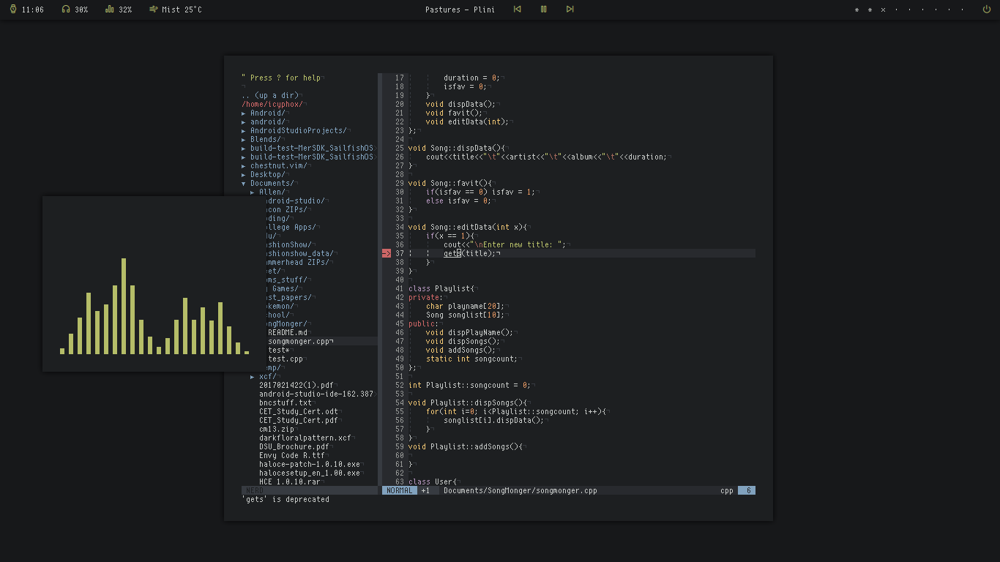
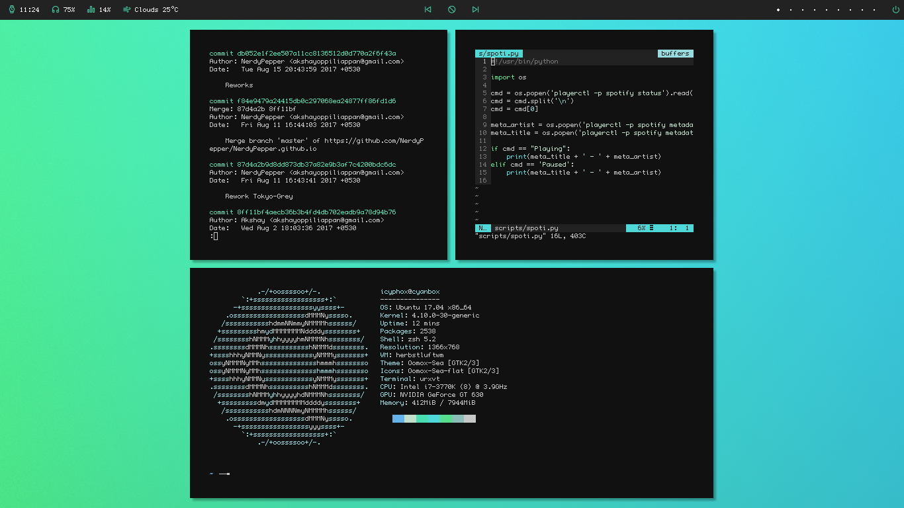

# dotfiles

A bunch of files that are essential to my linux box.

#### window manager

herbstluft WM - more info 


#### terminal

- 

-  (Better font rendering)


#### vim

the one true text editor, for lightning fast edits.

 - auto-pairs - match braces with ease
 
 - airline - fancy statusline for vim
 
 - line-no-indicator - minimal current line indicator
 
 - nerdtree - file browser for vim
 
 - youcompleteme - auto complete and C semantic error correction
 
 - gitgutter - git diffs in vim's sign coloumn

check out some of my themes: , 
.


#### status bar

 - easiest way to create statusbars.


#### scripts

python scripts to display info in my polybar (and to burn my cpu).

 - hlws.py - herbstluft workspaces
 
 - playpause.py - dynamic media control icon
 
 - weather.py - display current weather status from using openweathermap api
 
 - nerdinfo.sh - a small system info script


#### shell

 - because oh-my-zsh and autocomplete

 - git : plugin with a bunch of useful git aliases
 
 - web-search : search from terminal
 
 - sudo : double tap  ```Esc```  to insert sudo at the beginning of current command


#### gtk 
 - graphical gtk theme generator


#### misc

-  - X11 compositor for smooth transitions and shadows.

-  - lightweight notification daemon.

-  - simple applicaton launcher


### screenshots



